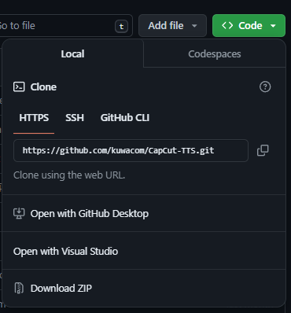

# YMM4-CapCut
これはYMM4場でCapCutの合成音声が使えるようになるPluginです。
## 使い方
### 前提ソフトのインストール
使用するには[CapCut-TTS](https://github.com/kuwacom/CapCut-TTS)が必要です。
[CapCut-TTS](https://github.com/kuwacom/CapCut-TTS)を起動させるには[Bun](https://bun.sh)が必要です。
まず、[リリースページ](https://github.com/kuwacom/CapCut-TTS)からCodeを押して、zipファイルをダウンロードしてください。

それを解凍して、中に入り何もないところで右クリックしてターミナルで開くを押してください。
そこで`powershell -c "irm bun.sh/install.ps1|iex"`と打ち込んでください。
それから`bun update&&bun run .\src\index.ts`と打ち込んでください。
そうすると、CapCut-TTSが起動します。
次回からは`bun run .\src\index.ts`だけで起動できます。
### Pluginのインストール
[リリースページ](https://github.com/taisan11/YMM4-CapCut/releases)から最新のPluginをダウンロードしてください。
そして、YMM4Pluginのインストール手順にしたがってインストールしてください。
### 使い方
1. CapCut-TTSを起動してください。
2. YMM4の声の設定に「CapCutTTS/数字」があるので好きな数字を選択してください。
3. 普段通りにセリフを打ってください。
### 声の設定の数字の対応表
| type | 声の種類          | スピーカーID            |
|------|------------------|-------------------------|
| 0    | 謎1 男子1        | BV525_streaming         |
| 1    | 謎2 坊や          | BV528_streaming         |
| 2    | カワボ            | BV017_streaming         |
| 3    | お姉さん          | BV016_streaming         |
| 4    | 少女              | BV023_streaming         |
| 5    | 女子              | BV024_streaming         |
| 6    | 男子2             | BV018_streaming         |
| 7    | 坊ちゃん          | BV523_streaming         |
| 8    | 女子              | BV521_streaming         |
| 9    | 女子アナ          | BV522_streaming         |
| 10   | 男性アナ          | BV524_streaming         |
| 11   | 元気ロリ          | BV520_streaming         |
| 12   | 明るいハニー      | VOV401_bytesing3_kangkangwuqu |
| 13   | 優しいレディー    | VOV402_bytesing3_oh     |
| 14   | 風雅メゾソプラノ  | VOV402_bytesing3_aidelizan |
| 15   | Sakura            | jp_005                  |
| その他/入力なし | お姉さん         | BV016_streaming |